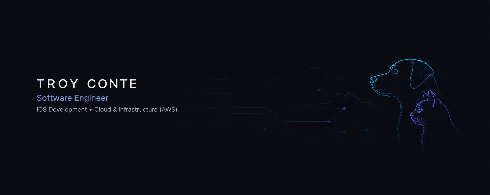
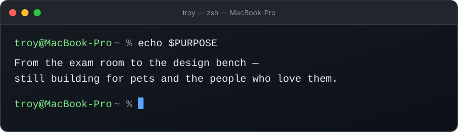

  

 

 

## 01 // FEATURED WORK

<table>
<tr>
<td width="50%" valign="top">

### PetIntelHQ

**iOS pet-health management application**

An original iOS application shaped by my experience in veterinary medicine. I’m rebuilding PetIntelHQ with a stronger focus on architecture, UI/UX, data organization, and features grounded in real veterinary workflows.

**Core focus**

`Swift` `SwiftUI` `Xcode` `UI/UX`

[View development repository →](https://github.com/troygianni/PetIntelHQ)

</td>
<td width="50%" valign="top">

### AWS Cloud Web Application

**Cloud deployment and infrastructure project**

Deployed and configured a web application on AWS while working directly with cloud infrastructure, server configuration, traffic distribution, and troubleshooting in a live environment.

**Core focus**

`AWS` `Linux` `Deployment` `Infrastructure`

[View source and architecture →](https://github.com/troygianni/aws-cloud-web-app-project)

</td>
</tr>
</table>

 

## 02 // TECH STACK

&nbsp;&nbsp;&nbsp;

&nbsp;&nbsp;&nbsp;

&nbsp;&nbsp;&nbsp;

&nbsp;&nbsp;&nbsp;

&nbsp;&nbsp;&nbsp;

 

<table>
<tr>
<td width="50%" valign="top">

### SOFTWARE + iOS

**Swift · SwiftUI · Python · Bash · Git · GitHub**

Building native iOS applications, scripting development workflows, and managing source-controlled projects.

</td>
<td width="50%" valign="top">

### AWS + CLOUD

**EC2 · IAM · Security Groups · Lambda · API Gateway**

Deploying, configuring, securing, and troubleshooting cloud infrastructure on AWS.

</td>
</tr>

<tr>
<td width="50%" valign="top">

### DEVOPS + AUTOMATION

**Ansible · YAML · Docker · Docker Compose · IaC**

Automating configuration, containerizing applications, and creating repeatable infrastructure workflows.

</td>
<td width="50%" valign="top">

### LINUX + INFRASTRUCTURE

**Ubuntu · Rocky Linux · SSH · Apache · HAProxy · MariaDB/MySQL**

Configuring Linux servers, web services, databases, and supporting application infrastructure.

</td>
</tr>
</table>

### NETWORKING + TROUBLESHOOTING

`Wireshark` `Nmap` `DNS` `HTTP` `Root-Cause Analysis`

Diagnosing connectivity, validating configurations, and tracing problems across application and infrastructure layers.

 

## 03 // CURRENTLY

<table>
<tr>
<td width="50%" valign="top">

### `BUILDING //`

**PetIntelHQ**

Rebuilding PetIntelHQ in SwiftUI with an emphasis on architecture, navigation, UI/UX, and features informed by real veterinary workflows.

</td>
<td width="50%" valign="top">

### `LEARNING //`

**Cloud + DevOps**

Expanding my infrastructure skill set through Terraform and CI/CD concepts, with the goal of applying them to future AWS projects.

</td>
</tr>

<tr>
<td width="50%" valign="top">

### `PREPARING //`

**CompTIA Security+**

Strengthening my security, networking, and troubleshooting fundamentals while preparing for the CompTIA Security+ certification.

</td>
<td width="50%" valign="top">

### `NEXT //`

**Better Engineering Workflows**

Adding tests, GitHub Actions, and structured development practices so my repositories demonstrate not only what I build, but how I build it.

</td>
</tr>
</table>

 

## 04 // LET’S CONNECT

I’m exploring opportunities where I can contribute, continue learning, and build meaningful technology—particularly across software engineering, iOS development, and cloud infrastructure.

 

